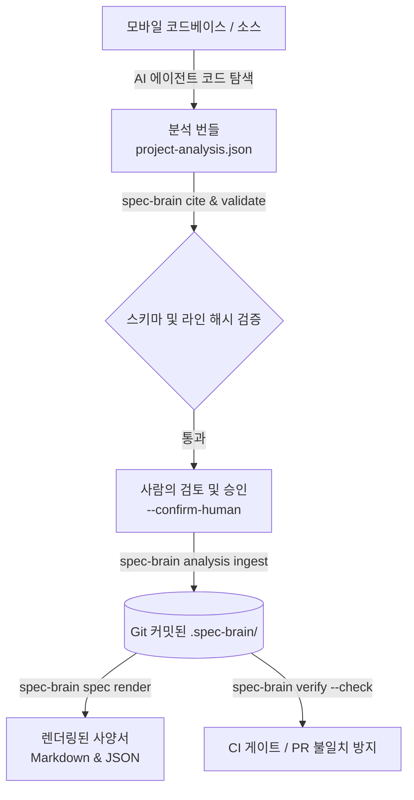

# Mobile Spec Brain

<div align="center">

[](<>)
[](https://www.typescriptlang.org/)
[](https://pnpm.io/)
[](LICENSE)

**AI의 코드 분석을 인용(Citation) 기반의 검증 가능하고 드리프트 없는 모바일 사양(Spec) 상태로 변환합니다.**

[English](README.md) | [한국어](README.ko.md)

</div>

---

## 💡 Mobile Spec Brain이란?

모바일 제품 개발 과정에서는 기획 요구사항, Figma 디자인, Swagger/OpenAPI 명세, Android/iOS/KMP 구현 코드가 시간이 지나면서 점차 어긋나는 **사양 불일치(Specification Drift)** 현상이 빈번하게 발생합니다.

**Mobile Spec Brain**은 이 문제를 혁신적으로 해결합니다:

1. **AI 탐색 (AI Exploration)**: 외부 AI 에이전트(Claude Code, Cursor, Antigravity 등)가 프로젝트 소스 코드를 탐색하여 기능(Feature)을 발견하고 구조화된 관찰 결과를 제안합니다.
2. **결정론적 신뢰 검증 (Deterministic Trust)**: CLI가 실제 소스 코드 라인 범위와 SHA-256 해시(`Citation`)를 직접 대조하여 검증합니다. 거짓 인용이나 환각(Hallucination)은 시스템을 통과할 수 없습니다.
3. **Git 기반 단일 진실 공급원 (Git-Native)**: 승인된 사양은 `.spec-brain/` 디렉토리에 버전 관리(Git commit) 가능한 JSON 파일로 안전하게 커밋됩니다.
4. **CI 드리프트 차단 (Zero-Drift CI Gating)**: CI 파이프라인에서 `spec-brain verify --check`를 실행하여 코드가 변경되었는데 사양이 갱신되지 않은 경우 PR 병합을 자동으로 방지합니다.



---

## 🌟 핵심 설계 철학

- **LLM은 신뢰할 수 없는 엔티티 ([ADR-003](docs/decisions/ADR-003-llm-untrusted.md))**: AI는 데이터와 관찰을 제안할 뿐, 파일 수정이나 커밋 결정은 Zod 스키마, 소스 격리 규칙, 결정론적 라인 해시 검증, 그리고 **사람의 명시적 확인(`--confirm-human`)**을 통해서만 이루어집니다.
- **사양 이전에 증거 (Evidence Before Spec) ([ADR-001](docs/decisions/ADR-001-evidence-before-spec.md))**: 근거 없는 사양 작성을 금지합니다. 모든 주장은 소스 코드의 특정 라인 범위와 해시값으로 봉인된 인용(Citation)을 기반으로 합니다.
- **5대 고정 커버리지 프로토콜 (Fixed 5-Section Coverage)**: 모든 기능은 `product`(기획), `design`(디자인), `api`(API 계약), `implementation`(구현), `navigation`(화면 이동) 5개 영역의 상태(`ANALYZED`, `UNKNOWN`, `NOT_APPLICABLE`, `SOURCE_UNAVAILABLE`)를 명시해야 합니다. AI가 아는 척하며 거짓 100% 완료율을 보고하는 것을 원천 차단합니다.
- **추가 전용 및 히스토리 승계 ([ADR-002](docs/decisions/ADR-002-append-only-history.md), [ADR-008](docs/decisions/ADR-008-project-wide-analysis-bundles.md))**: 코드가 바뀌면 새로운 주장이 이전 주장을 승계(`supersedes`)합니다. 이전 버전의 오래된 증거는 히스토리로 보존되면서도 현재 CI를 방해하지 않습니다.

---

## 🚀 실무 적용 가이드 & 워크플로우

### 1. 설치 및 프로젝트 초기화

모바일 프로젝트 루트(Android, iOS, KMP, Flutter, React Native 등)에서 초기 설정을 진행합니다:

```sh
# 1. mobile-spec-brain 빌드 및 CLI 글로벌 등록
git clone https://github.com/KEZ-AI-LABS/mobile-spec-brain.git
cd mobile-spec-brain
pnpm install && pnpm build
cd apps/cli && npm link

# 2. 적용할 모바일 프로젝트로 이동
cd /path/to/my-mobile-app

# 3. .spec-brain 초기화
spec-brain init

# 4. 자동 생성되는 사양 뷰는 .gitignore에 추가
echo ".spec-brain/spec/" >> .gitignore
git add .spec-brain .gitignore
git commit -m "chore: initialize spec-brain"
```

### 2. AI 에이전트로 프로젝트 분석 (초기 베이스라인 구축)

사용 중인 AI 코딩 어시스턴트(Claude Code, Cursor, Antigravity 등)에게 프로젝트 분석을 요청합니다:

1. **분석 계약 규격 확인**:
   ```sh
   spec-brain analysis contract
   ```
2. **AI가 코드를 탐색하며 인용(Citation) 생성**:
   AI가 코드에서 특정 비즈니스 로직이나 API 호출을 확인할 때마다 CLI 명령어로 정확한 라인 해시를 획득합니다:
   ```sh
   spec-brain cite src/feature/TransferUseCase.kt 15 32
   ```
3. **`project-analysis.json` 번들 파일 생성**:
   AI가 탐색한 `filesRead`, `excluded`, 발견된 `features`, 5대 커버리지, `evidence`, `claims`를 포함한 단일 번들을 작성합니다.

### 3. 검증 및 적용 (Human-in-the-Loop)

```sh
# 1단계: 스키마, 경로 보안, 인용 해시 무결성 검증 (Read-only)
spec-brain analysis validate --file project-analysis.json

# 2단계: 번들 내용을 검토한 후 사람이 명시적으로 반영
spec-brain analysis ingest --file project-analysis.json --confirm-human

# 3단계: 베이스라인 스펙 Git 커밋
git add .spec-brain/
git commit -m "docs: ingest initial project specification baseline"
```

### 4. 기능별 사양 렌더링 및 확인

팀원, 기획자, 개발자가 언제든지 최신 사양을 읽기 쉬운 Markdown 및 JSON으로 확인할 수 있습니다:

```sh
# 특정 기능의 전체 사양 렌더링 (예: bookmark)
spec-brain spec render bookmark

# 특정 섹션만 좁혀서 렌더링 (api | figma | implementation | navigation | unknowns)
spec-brain spec render bookmark --section api
```

`.spec-brain/spec/bookmark.md` 파일에 다음 내용이 생성됩니다:

- **Protocol Coverage**: 기획, 디자인, API, 구현, 네비게이션 분석 완료 여부
- **API Contracts**: 엔드포인트, HTTP 메서드, 파라미터, 요청/응답 스키마
- **Navigation Routes**: 화면 진입(`incoming`) 및 진출(`outgoing`) 경로/딥링크
- **미해결 사항 (`unknowns`)**: 기획 누락, 미구현 상태, 검토가 필요한 항목 명시

### 5. CI 파이프라인 연동 (사양 드리프트 방지)

GitHub Actions(`.github/workflows/spec-drift.yml`)에 사양 불일치 방지 검사를 추가합니다:

```yaml
name: Specification Drift Gate
on: [pull_request]

jobs:
  verify:
    runs-on: ubuntu-latest
    steps:
      - uses: actions/checkout@v4
      - uses: actions/setup-node@v4
        with:
          node-version: 20
      - run: npx @mobile-spec-brain/cli verify --check
```

- `verify --check`는 유효한 사양의 코드 인용이 수정되어 불일치가 발생하면 **Exit Code 1**을 반환하여 PR 병합을 막습니다.
- **완전한 Read-Only 모드**: 파일을 수정하지 않고 Git 상태를 깨끗하게 유지합니다.

### 6. 실제 코드 수정 시 사양 갱신 워크플로우

비즈니스 로직이나 API 엔드포인트가 수정된 경우:

1. `verify --check` 실행 시 수정된 코드 라인이 `STALE` 상태로 감지되어 CI가 실패합니다.
2. AI에게 변경된 코드를 바탕으로 새 번들을 작성하게 합니다. (새 claim ID를 부여하고 `"supersedes": "이전_claim_id"` 지정)
3. `spec-brain analysis ingest --file update.json --confirm-human`으로 반영합니다.
4. `verify --check`가 다시 성공(Exit 0)하며, 이전 히스토리는 안전하게 보존됩니다.

---

## 💻 CLI 명령어 레퍼런스

| 명령어                                          | 설명                                                                         |
| :---------------------------------------------- | :--------------------------------------------------------------------------- |
| `init`                                          | `.spec-brain/` 디렉토리를 생성하고 프로젝트 소스를 등록합니다.               |
| `analysis contract`                             | AI 분석 번들의 JSON 스키마 및 프로토콜 규격을 출력합니다.                    |
| `analysis validate --file <경로>`               | 번들의 스키마, 참조, 경로 보안, 인용 해시 무결성을 검증합니다 (읽기 전용).   |
| `analysis ingest --file <경로> --confirm-human` | 검토된 분석 번들을 `.spec-brain/`에 최종 반영합니다.                         |
| `cite <경로> <시작줄> <끝줄> [--source id]`     | 소스 코드 라인 범위에 대한 암호화 검증 인용(Citation)을 생성합니다.          |
| `spec render <기능명> [--section <이름>]`       | 특정 기능의 `.spec.json` 및 `.md` 사양 뷰를 생성합니다.                      |
| `verify`                                        | 전체 드리프트 상태 보고서를 출력합니다 (JSON 형식, Exit `0`).                |
| `verify --check`                                | **CI 게이트 모드**: 현재 드리프트 발생 시 Exit `1`로 실패합니다 (읽기 전용). |
| `verify --write`                                | 계산된 상태 전이(ACTIVE ➔ STALE 등)를 파일에 명시적으로 기록합니다.          |
| `coverage`                                      | 전체 증거(Evidence) 및 주장(Claim)의 상태별 커버리지 통계를 출력합니다.      |
| `graph query [--feature f] [--predicate p]`     | 현재 유효한 주장과 이를 뒷받침하는 증거 인용을 쿼리합니다.                   |
| `profile read \| propose --file <경로>`         | 프로젝트 전반의 코딩 컨벤션 및 프로필을 조회하거나 제안합니다.               |
| `evidence record \| query \| invalidate`        | 저수준 증거 조회 및 수동 무효화 작업을 수행합니다.                           |
| `claim propose \| supersede --file <경로>`      | 저수준 주장 등록 및 승계 작업을 수행합니다.                                  |

---

## 📁 프로젝트 구조

```text
mobile-spec-brain/
├── packages/
│   ├── core/         # Zod 스키마 계약, 결정론적 직렬화, SHA-256 해시, 사양 프로젝션
│   └── storage/      # 소스 격리 보안, 원자적 파일 저장소, 검증 엔진, 인용 빌더
├── apps/
│   └── cli/          # CLI 커맨드라인 인터페이스 및 마크다운 렌더러
├── docs/
│   ├── architecture.md   # 전체 시스템 아키텍처 및 스토리지 모델
│   ├── workflow.md       # 팀 도입 상세 워크플로우 가이드
│   ├── decisions/        # 아키텍처 결정 기록 (ADR-001 ~ ADR-008)
│   └── verification/     # 실제 KMP 프로젝트 파일럿 검증 보고서
└── .claude/commands/     # Claude Code 전용 분석 슬래시 커맨드
```

---

## 🧪 빌드 및 테스트

```sh
# 의존성 설치
pnpm install

# 전체 패키지 빌드
pnpm build

# 타입 체크, 린트, 코드 포맷팅 검사
pnpm check

# Vitest 전체 테스트 스위트 실행
pnpm test
```

---

## 📚 관련 문서

- [팀 도입 워크플로우 가이드](docs/workflow.md)
- [시스템 아키텍처 및 스토리지 모델](docs/architecture.md)
- [데이터 및 인용 모델](docs/data-model.md)
- [보안 및 소스 격리 모델](docs/security-model.md)
- [아키텍처 결정 기록 (ADRs)](docs/decisions/)
- [KMP 프로젝트 파일럿 검증 보고서](docs/verification/2026-08-10-project-wide-kmp-pilot.md)

---

## 📄 라이선스

이 프로젝트는 [MIT 라이선스](LICENSE)를 따릅니다.
