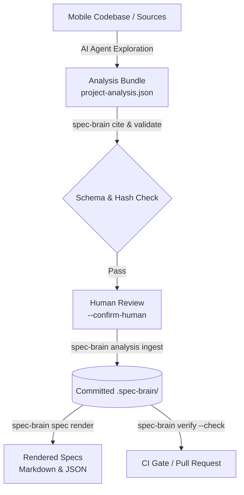

# Mobile Spec Brain

<div align="center">

[](<>)
[](https://www.typescriptlang.org/)
[](https://pnpm.io/)
[](LICENSE)

**Turns AI code exploration into cited, reviewable, and drift-resistant specification state for mobile projects.**

[English](README.md) | [한국어](README.ko.md)

</div>

---

## 💡 What is Mobile Spec Brain?

Mobile product development often suffers from **specification drift**—where product requirements, Figma designs, Swagger/OpenAPI contracts, Android, iOS, and KMP implementations gradually diverge.

**Mobile Spec Brain** bridges this gap:

1. **AI Explores**: An external AI agent (Claude Code, Cursor, Antigravity, etc.) reads your codebase, discovers features, and proposes structured observations.
2. **Deterministic Trust Enforcement**: The CLI verifies every source code line range with SHA-256 hashes (`Citation`). No fake or hallucinated citations can pass.
3. **Git-Native Source of Truth**: Approved specifications are committed directly to `.spec-brain/` as reviewable JSON documents.
4. **Zero-Drift CI Gating**: CI runs `spec-brain verify --check` in read-only mode to prevent code from drifting away from specifications without a conscious update.



---

## 🌟 Key Principles

- **LLMs are Untrusted ([ADR-003](docs/decisions/ADR-003-llm-untrusted.md))**: AI models propose structured data, but deterministic Zod schemas, path containment rules, and SHA-256 citation hashes decide what is allowed.
- **Evidence Before Spec ([ADR-001](docs/decisions/ADR-001-evidence-before-spec.md))**: Specs are never handwritten assumptions. Every assertion originates from cited source code lines.
- **Fixed 5-Section Protocol Coverage**: Every feature explicitly declares statuses (`ANALYZED`, `UNKNOWN`, `NOT_APPLICABLE`, `SOURCE_UNAVAILABLE`) across `product`, `design`, `api`, `implementation`, and `navigation`. AI cannot hide missing knowledge behind a fake 100% score.
- **Append-Only & Historical Supersession ([ADR-002](docs/decisions/ADR-002-append-only-history.md), [ADR-008](docs/decisions/ADR-008-project-wide-analysis-bundles.md))**: When code evolves, new claims supersede older ones. Historical stale evidence is preserved without failing current CI checks.

---

## 🚀 Quick Start & Practical Workflow

### 1. Installation & Initialization

In your mobile project root (Android, iOS, KMP, Flutter, React Native, etc.):

```sh
# Clone and build mobile-spec-brain (or link CLI globally)
git clone https://github.com/KEZ-AI-LABS/mobile-spec-brain.git
cd mobile-spec-brain
pnpm install && pnpm build
cd apps/cli && npm link

# In your target mobile repository:
cd /path/to/my-mobile-app
spec-brain init

# Add generated markdown views to .gitignore
echo ".spec-brain/spec/" >> .gitignore
git add .spec-brain .gitignore
git commit -m "chore: initialize spec-brain"
```

### 2. AI Project Exploration & Baseline Specification

Ask your AI coding assistant (Claude Code, Cursor, Antigravity, etc.) to analyze the repository:

1. **Check the bundle contract**:
   ```sh
   spec-brain analysis contract
   ```
2. **Build citations during exploration**:
   When the AI observes a behavior or contract in code, it acquires an exact citation:
   ```sh
   spec-brain cite src/feature/TransferUseCase.kt 15 32
   ```
3. **Emit `project-analysis.json`**:
   The AI produces a single structured analysis bundle containing `filesRead`, `excluded`, discovered `features`, `evidence`, and `claims`.

### 3. Validate & Ingest (Human-in-the-Loop)

```sh
# Step 1: Validate schemas, paths, and citation hashes (Read-only)
spec-brain analysis validate --file project-analysis.json

# Step 2: Human reviews the bundle and applies it
spec-brain analysis ingest --file project-analysis.json --confirm-human

# Step 3: Commit specification baseline
git add .spec-brain/
git commit -m "docs: ingest initial project specification baseline"
```

### 4. Render & View Feature Specifications

Generate human-readable Markdown and machine-readable JSON:

```sh
# Render full specification for a feature
spec-brain spec render bookmark

# Or narrow to a specific section (api | figma | implementation | navigation | unknowns)
spec-brain spec render bookmark --section api
```

The rendered file at `.spec-brain/spec/bookmark.md` includes:

- **Protocol Coverage**: Status of product, design, API, implementation, and navigation.
- **API Contracts**: Method, path, parameters, request body, and response types.
- **Navigation Routes**: Incoming and outgoing deep links / routes.
- **Unresolved (`unknowns`)**: Missing requirements or unanalyzed sections that require developer attention.

### 5. Gate CI Against Specification Drift

Add a read-only check to your GitHub Actions workflow (`.github/workflows/spec-drift.yml`):

```yaml
name: Specification Drift Gate
on: [pull_request]

jobs:
  verify:
    runs-on: ubuntu-latest
    steps:
      - uses: actions/checkout@v4
      - uses: actions/setup-node@v4
        with:
          node-version: 20
      - run: npx @mobile-spec-brain/cli verify --check
```

- `verify --check` exits with `1` if any current active claim or coverage section has stale/orphaned citations.
- It is **completely read-only**: it writes no files, appends no events, and leaves Git working tree clean.

### 6. Resolving Drift When Code Changes

When you refactor code or update a business rule:

1. `verify --check` flags the modified citation as `STALE`.
2. AI updates the affected feature in a new bundle, giving the new claim a fresh ID and setting `"supersedes": "previous-claim-id"`.
3. Ingest the bundle with `spec-brain analysis ingest --file update.json --confirm-human`.
4. `verify --check` passes again, while historical changes remain audit-trailed.

---

## 💻 CLI Command Reference

| Command                                         | Description                                                                         |
| :---------------------------------------------- | :---------------------------------------------------------------------------------- |
| `init`                                          | Creates `.spec-brain/` directory and registers initial project sources.             |
| `analysis contract`                             | Prints the JSON schema and protocol contract for AI analysis bundles.               |
| `analysis validate --file <path>`               | Validates bundle schemas, references, containment, and citation hashes (read-only). |
| `analysis ingest --file <path> --confirm-human` | Ingests a reviewed analysis bundle into `.spec-brain/`.                             |
| `cite <path> <start> <end> [--source id]`       | Generates a cryptographically verified line-range citation.                         |
| `spec render <feature> [--section <name>]`      | Materializes `.spec.json` and `.md` views for a given feature.                      |
| `verify`                                        | Generates a full drift report (JSON output, exits `0`).                             |
| `verify --check`                                | CI Gate mode: exits `1` if current drift is detected. Read-only.                    |
| `verify --write`                                | Explicitly persists calculated state transitions to disk.                           |
| `coverage`                                      | Displays effective coverage statistics across evidence and claims.                  |
| `graph query [--feature f] [--predicate p]`     | Queries current active claims and their supporting citations.                       |
| `profile read \| propose --file <path>`         | Reads or proposes cited project-wide profile conventions.                           |
| `evidence record \| query \| invalidate`        | Low-level evidence inspection and manual invalidation.                              |
| `claim propose \| supersede --file <path>`      | Low-level claim operations.                                                         |

---

## 📁 Repository Structure

```text
mobile-spec-brain/
├── packages/
│   ├── core/         # Schemas (Zod), stable serialization, SHA-256, spec projections
│   └── storage/      # Path containment, atomic file store, verification engine, citations
├── apps/
│   └── cli/          # Command-line interface & Markdown renderer
├── docs/
│   ├── architecture.md   # Architectural overview & directory structure
│   ├── workflow.md       # Detailed team adoption workflow
│   ├── decisions/        # Architecture Decision Records (ADR-001 ~ ADR-008)
│   └── verification/     # Real-world verification & pilot reports (e.g., KMP pilot)
└── .claude/commands/     # Claude Code slash command for spec-brain analysis
```

---

## 🧪 Development & Verification

```sh
# Install dependencies
pnpm install

# Build all packages
pnpm build

# Type check, lint, and format check
pnpm check

# Run all test suites (Vitest)
pnpm test
```

---

## 📚 References & Documentation

- [Team Adoption Workflow Guide](docs/workflow.md)
- [System Architecture & Storage Model](docs/architecture.md)
- [Data & Citation Model](docs/data-model.md)
- [Security & Containment Model](docs/security-model.md)
- [Architecture Decision Records (ADRs)](docs/decisions/)
- [Project-wide KMP Pilot Report](docs/verification/2026-08-10-project-wide-kmp-pilot.md)

---

## 📄 License

This project is licensed under the [MIT License](LICENSE).
